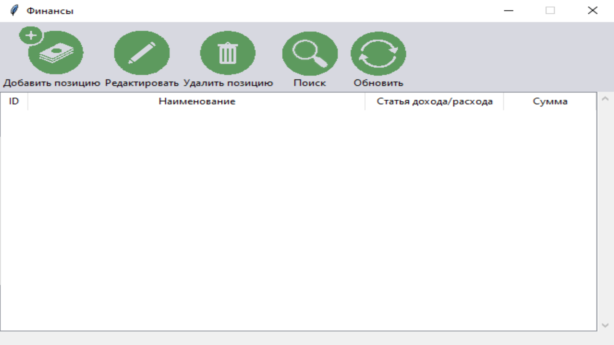
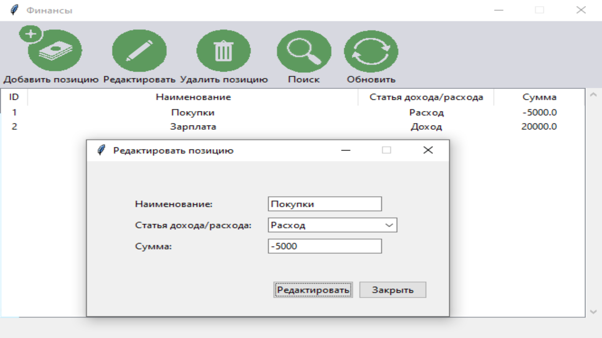

# Ппограма для отслеживания финансов с БД и ГУИ.


## Создание БД.
За создание БД отвечает файл Bdcreat и находящиеся в ней функция 
```    
def __init__(self):
        self.conn = sqlite3.connect('finance.db')
        self.c = self.conn.cursor() 
        self.c.execute("""
        CREATE TABLE IF NOT EXISTS finance (id integer primary key, description text, costs text, total real)
        """) 
        self.conn.commit()
```
## Добавление данных в таблицу.
За добавление даных в таблицу отвечают функции:
1.Функция выполняющая SQL запрос к БД для занесения в неё даных. 
```
    def __init__(self):
        self.conn = sqlite3.connect('finance.db')
        self.c = self.conn.cursor()
        self.c.execute("""
        CREATE TABLE IF NOT EXISTS finance (id integer primary key, description text, costs text, total real)
        """)
        self.conn.commit()
 ```
 2.Функция отображает информацию из базы даных. 
```
    def view_records(self):
        self.db.c.execute('''SELECT * FROM finance''')
        [self.tree.delete(i) for i in self.tree.get_children()]
        [self.tree.insert('', 'end', values=row) for row in self.db.c.fetchall()]
```


## Редактиворание данных.
1.Функция которая выполняет действие по редактированию в БД.
```
    def update_record(self, description, costs, total):
        self.db.c.execute('''UPDATE finance SET description=?, costs=?, total=? WHERE ID=?''',
                          (description, costs, total, self.tree.set(self.tree.selection()[0], '#1')))
        self.db.conn.commit()
        self.view_records()
```


## Удаление данных.
1.Функция которая отвечает за удаление.
```
    def delete_records(self):
        for selection_item in self.tree.selection():
            self.db.c.execute('''DELETE FROM finance WHERE id=?''', (self.tree.set(selection_item, '#1'),))
        self.db.conn.commit()
        self.view_records()
```


## Поиск данных.
1.Функция для поиска данных.    
```
def search_records(self, description):
        description = ('%' + description + '%',)
        self.db.c.execute('''SELECT * FROM finance WHERE description LIKE ?''', description)
        [self.tree.delete(i) for i in self.tree.get_children()]
        [self.tree.insert('', 'end', values=row) for row in self.db.c.fetchall()]
```


